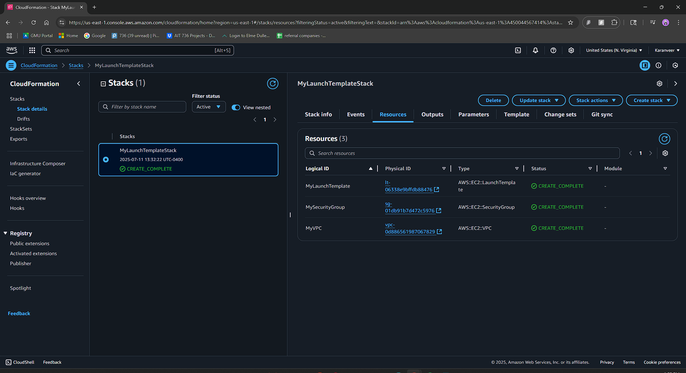
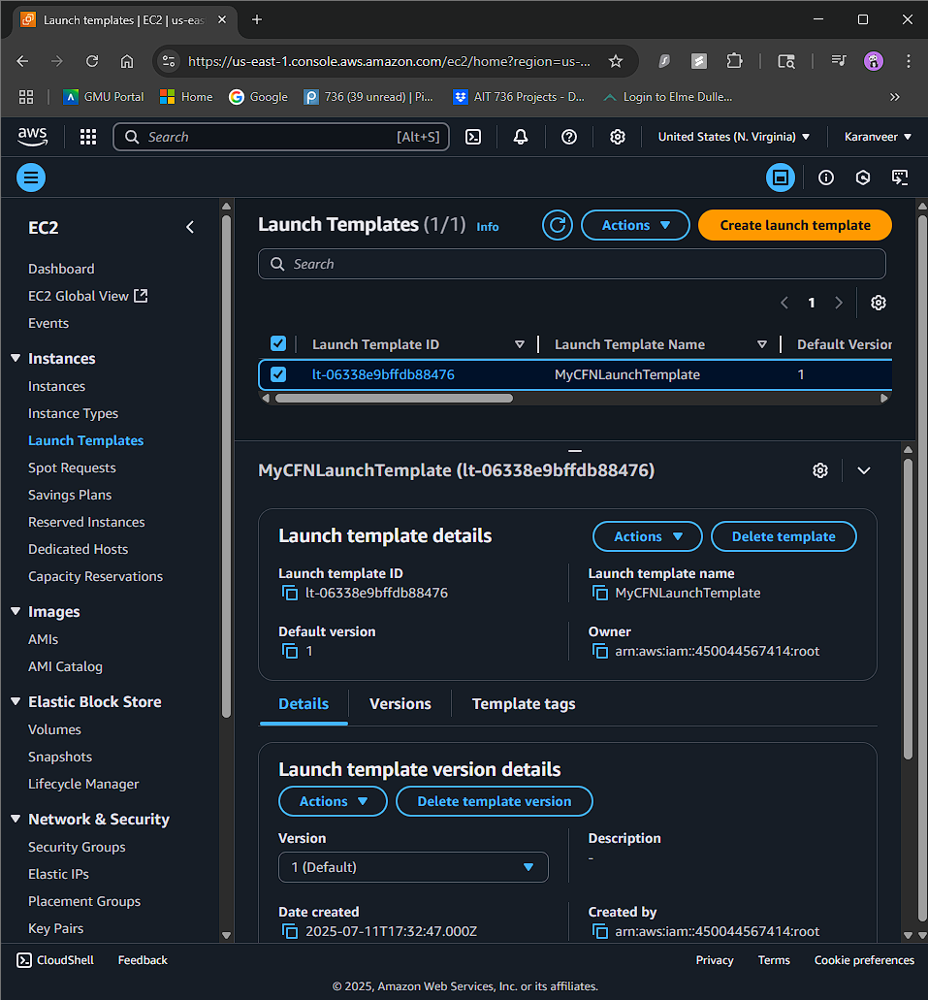

# AWS EC2 Launch Template via CloudFormation

This repository contains a simple AWS CloudFormation YAML template that creates an EC2 Launch Template along with the required networking and security resources, all within AWS Free Tier limits.

## 🛠️ What This Project Does

- Creates an **EC2 Launch Template** using CloudFormation
- Provisions:
  - A custom **VPC**
  - A **Security Group** allowing SSH (22) and HTTP (80)
  - The **Launch Template** configured to use Amazon Linux 2 AMI and a `t2.micro` instance

This setup is ideal for learning how to automate infrastructure using CloudFormation and using Launch Templates in Auto Scaling Groups.

## 📁 Files Included

| File | Description |
|------|-------------|
| `launch-template.yaml` | The CloudFormation template to provision AWS resources |
| `18.png` | Screenshot of the CloudFormation **Resources tab** |
| `19.png` | Screenshot showing the **EC2 Launch Template** in the AWS EC2 Dashboard |

## 📸 Screenshots

### 1. CloudFormation Stack Resources

### 2. EC2 Launch Template View

## ✅ Requirements

- AWS Account (Free Tier eligible)
- An existing EC2 Key Pair named `MyKeyPair` in your region
- Default service limits for EC2 and VPC

## 🚀 How to Use

1. Go to AWS Console → **CloudFormation**
2. Create a new stack using the `launch-template.yaml` file
3. Use any stack name (e.g., `MyLaunchTemplateStack`)
4. Wait for the stack status to become **CREATE_COMPLETE**
5. Verify resources in the **Resources tab**
6. Open **EC2 → Launch Templates** to confirm successful creation

## 📚 Reference

- [AWS::EC2::LaunchTemplate – AWS Docs](https://docs.aws.amazon.com/AWSCloudFormation/latest/UserGuide/aws-resource-ec2-launchtemplate.html)

---

**Author:** Venkata Karanveer Bejjam  
**License:** MIT  

